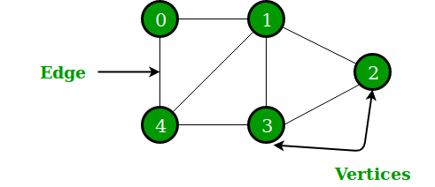

# Programming-II-Exercises

<b>Collection of exercises related to the course "Programming II"</b>  
The exercises contain sorting algorithms (such as insertionsort, mergesort, etc.) 
and data structures such as binary search trees, graphs, stacks and queues.  

